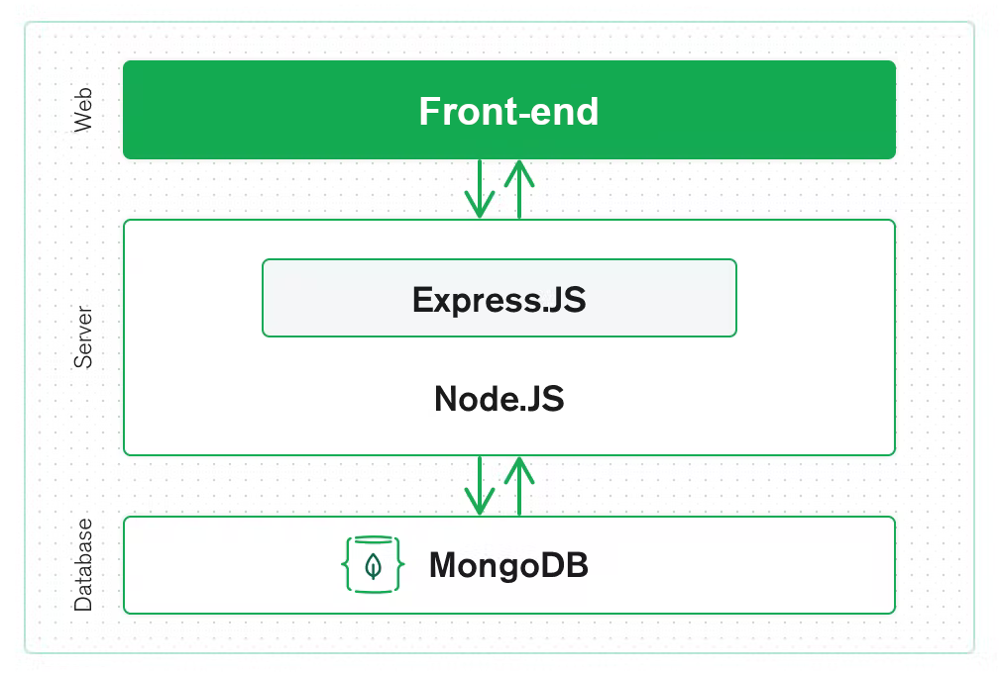

# Le vieux Grimoire

Je suis Jérémy Darbellay, développeur freelance, je travaille actuellement sur le projet du vieux grimoire, c'est un site de notation de livre entièrement codé en JavaScript, mon travail sur ce projet est de construire le back-end de cette application. Pour cela, j'ai du construire un back-end en Node.js, avec pour objectif que le front écrit avec React puisse afficher les données provenant du back. Au menu, un système d'authentification, des opérations cRUd sur des entités (livres) et un système de notation avec calcul de la note moyenne.


# Sommaire
+ [Le vieux Grimoire](#le-vieux-grimoire)
+ [Sommaire](#sommaire)
+ [Installation et lancement](#installation-et-lancement)
+ [Démonstration](#démonstration)
+ [Technologies utilisées](#technologies-utilisées)
+ [License](#license)

# Installation et lancement

Prérequis : Vous devez avoir nodejs et npm installés et fonctionnels, suivez ce lien pour installer les dernières versions stables : [installer Node.Js](https://nodejs.org/fr)

Voici les étapes à suivre pour lancer le projet en local :

1. Créer un dossier pour le projet
```bash
mkdir myProject
```

2. Cloner le répertoire
```bash
git clone https://github.com/JeremyDarbellay/projet_7_openclassrooms.git ./myProject
```

3. Naviguer jusqu'au dossier
```bash
cd myProject
```

4. Installer les dépendances
```bash
npm install
```

5. Démarrer le serveur
```bash
npm start
```

# Démonstration

Vous retrouverez la démonstration du site à cette adresse : 

# Technologies utilisées

-----


Pour ce projet, nous avons travaillé avec Node.Js, le framework Express.Js et la base de donnée MongoDB, nous avons utilisé le module Mongoose pour la communication simplifiée avec la base de donnée.
# License

[MIT](https://github.com/JeremyDarbellay/projet_6_openclassrooms/blob/main/LICENSE.md)

